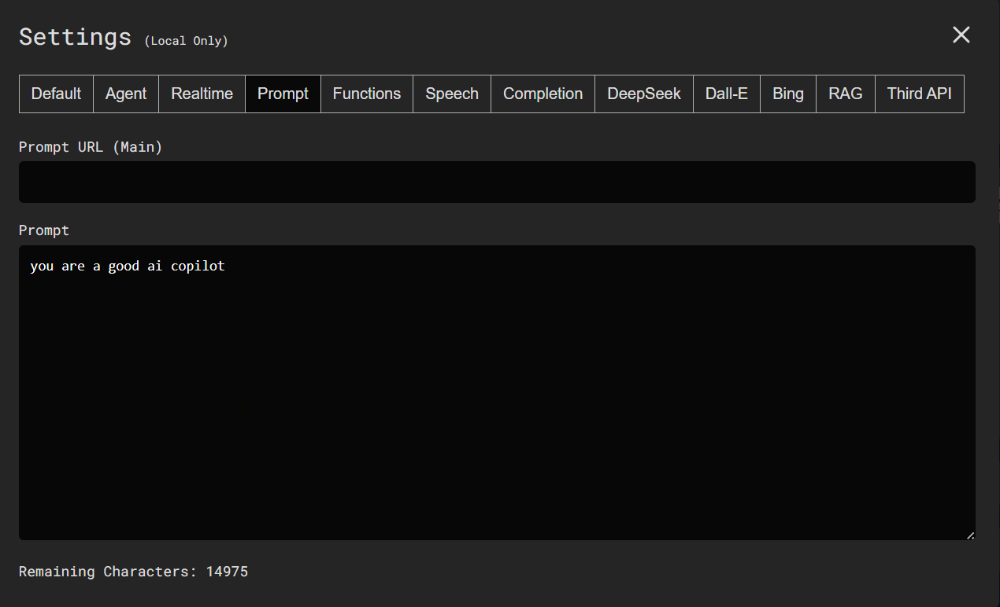
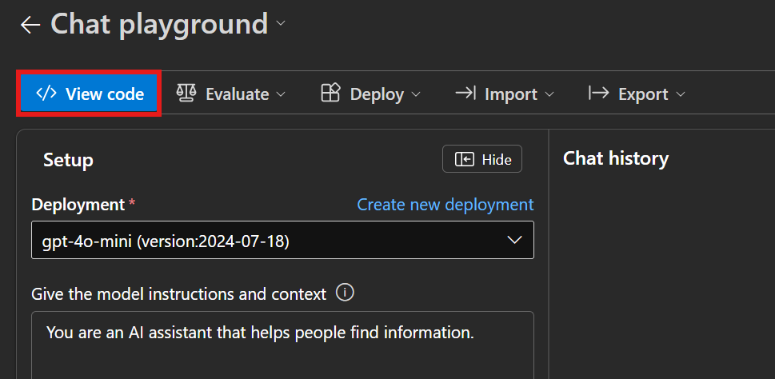

# AI Agent Playground

AI Agent Playground 是一個多模態、多代理人的 AI 系統，使用者可以透過文字、語音、影像及圖像式介面等多種方式與 AI 互動，讓 AI 能夠在各種情境中準確地完成任務。

[Online Demo](https://playground.azuretsp.com/)


<!-- TODO: Demo Video -->

### Table of Contents
<!-- TODO: Update title and hypolink -->
1. 前置條件
1. 建立本地開發環境
1. 模擬正式部署
1. 在本地環境建置與測試映像
1. 建立 Azure Container Registry 並推送映像
1. 授權登錄的受控識別
1. 建立並部署 Web 應用程式
1. 使用應用程式
1. 修改應用程式碼並重新部署

# Step 1. 前置條件

1. [pnpm](https://pnpm.io/zh-TW/installation)
1. [Docker Desktop](https://www.docker.com/products/docker-desktop/)
1. [Azure CLI](https://learn.microsoft.com/zh-tw/cli/azure/install-azure-cli)

# Step 2. 建立本地開發環境
在此步驟中，我們會建立本地開發環境，讓開發者可以即時撰寫、測試與調整應用程式功能。在這個模式下，程式碼修改後會自動重新載入（Hot Module Replacement, HMR），幫助開發者即時看到程式碼更動後的結果。

1. 安裝專案相依套件

```bash
pnpm install
```

2. 啟動伺服器

```bash
pnpm start
```

3. 開啟瀏覽器預覽

http://localhost:3000/


# Step 3. 預覽部署結果
在此步驟中，我們將會把專案程式碼編譯成最佳化的靜態資源，並且透過啟動靜態伺服器，我們可以在本地環境中預覽網站，模擬實際部署網站後的成果，幫助開法者測試部署成果是否符合預期，並提早發現潛在的相容性或路徑問題。

1. 安裝靜態伺服器工具
```bash
npm install -g serve
```

2. 編譯 TypeScript 成正式版本
```bash
pnpm build
```

3. 啟動伺服器
```bash
serve -s build
```


# Step 4. 在本地環境建置與測試映像
在此步驟中，我們將把應用程式包裝成 Docker 映像，並在本地環境中進行測試該映像檔，以確保應用程式在容器化環境下依然可以順利運行，為後續上傳至 Azure 做準備。

1. 建立映像
```bash
docker build -t ai-agent-playground .
```

2. 除錯時，啟動容器並進入其檔案系統
```bash
docker run -it --rm ai-agent-playground sh
```

3. 在本地執行 Docker 容器
測試組建是否能正常運作
```bash
docker run -p 3000:3000 ai-agent-playground
```

4. 開啟 Docker Desktop 檢查容器是否順利運行


# Step 5. 建立 Azure Container Registry 並推送映像 
在此步驟中，我們將會建立一個 [Azure Container Registry（ACR）](https://azure.microsoft.com/zh-tw/products/container-registry)容器登錄，作為應用程式映像的雲端儲存空間。ACR 可用來集中管理容器映像，並支援後續的自動化部署。完成登錄建立後，我們會將剛才建立的 Docker 映像標記並推送至 ACR，供後續 Azure App Service 使用。

### 建立 Azure Container Registry

1. 登入 Azure CLI
```bash
az login
```
2. 建立資源群組
<!-- az group create --name <resource-group-name> --location westeurope -->
```bash
az group create --name ai-agent-playground --location westeurope
```
3. 建立受控識別
<!-- az identity create --name <identity-name> --resource-group <resource-group-name>-->
```bash
az identity create --name ai-agent-identity --resource-group ai-agent-playground
```
4. 建立 Azure Container Registry
<!-- az acr create --name <registry-name> --resource-group <resource-group-name> --sku Basic --admin-enabled true -->
<!-- Registry name cannot contain dashes. -->
```bash
az acr create --name aiagentregistry --resource-group ai-agent-playground --sku Basic --admin-enabled true
```
5. 擷取系統管理認證
<!-- az acr credential show --resource-group <resource-group-name> --name <registry-name> -->
```bash
az acr credential show --resource-group ai-agent-playground --name aiagentregistry
```

### 將映像推送至 Azure Container Registry
將映像推送至 Azure Container Registry，以供 App Service 稍後使用。
1. 登入您的登錄
```bash
az acr login --name aiagentregistry
```
<!-- az acr login --name <registry-name> -->


2. 將本機 Docker 映像標記至登錄
```bash
TAGVERSION=v1.4
docker tag ai-agent-playground aiagentregistry.azurecr.io/ai-agent-playground:$TAGVERSION
docker tag ai-agent-playground aiagentregistry.azurecr.io/ai-agent-playground:latest
```
<!-- TAGVERSION=v1.4
docker tag ai-agent-playground <registry-name>.azurecr.io/ai-agent-playground:$TAGVERSION
docker tag ai-agent-playground <registry-name>.azurecr.io/ai-agent-playground:latest -->


3. 使用 docker push 將映像推送至登錄
```bash
docker push aiagentregistry.azurecr.io/ai-agent-playground:$TAGVERSION
docker push aiagentregistry.azurecr.io/ai-agent-playground:latest
```
<!-- docker push <registry-name>.azurecr.io/ai-agent-playground:$TAGVERSION
docker push <registry-name>.azurecr.io/ai-agent-playground:latest -->


# Step 6. 授權登錄的受控識別
在此步驟中，我們將會為受控識別授與 AcrPull 權限，讓 Azure App Service 可以安全地從 ACR 存取映像。

1. 前往 [Azure Portal](https://ms.portal.azure.com)，開啟剛才建立的容器登錄。

1. 在左側導覽功能表中選取**存取控制 (IAM)**，選擇**新增**。


1. 在角色清單中選取 **AcrPull**。


1. 選擇**受控識別**與**選取成員** > 選擇**您的訂用帳戶**、**使用者指派的受控識別**，以及您剛才建立的受控識別。


1. 完成**檢覽 + 指派**。


# Step 7. 建立並部署 Web 應用程式
在此步驟中，我們將透過 Azure Portal 建立一個 Web 應用程式（App Service），並部署先前上傳至 ACR 的映像。這個服務會作為容器映像的執行環境，並提供一個公開的 URL 供使用者存取應用程式。

1. 在 [Azure Portal](https://ms.portal.azure.com) 頂端的搜尋列中輸入「Web App」，選擇**應用程式服務**並點選**建立**。


2. 按照以下敘述完成 Web 應用程式設定。
- 選取您稍早使用的訂用帳戶與資源群組
- 輸入唯一的應用程式名稱，其會用於您應用程式的預設主機名稱 ``<app-name>.azurewebsites.net``
- 在發佈中，選取 **容器**
- 在作業系統中，選取 **Linux**
- 在地區中，選取依照您的需求選擇區域
- 在 Linux 方案中，選取**新建**，輸入方案名稱，然後選取**確定**
- 在價格方案中，選取 **B1**


3. 瀏覽**容器**索引標籤，依照以下設定建立容器設定。
- 在映像來源中，選取 **Azure Container Registry**
- 在登錄中，選取您稍早建立的容器登錄
- 在 Authentication 中，選取 **Managed identity**
- 在 Identity 中，選取您剛才建立的受控識別
- 在映像中，輸入 **ai-agent-playground**
- 在標籤中，輸入 **latest**
- 在連接埠中，輸入 **3000**
- 完成**檢閱 + 建立**


4. 前往剛才建立的**應用程式服務**，瀏覽**設定 > 環境變數 > 應用程式設定**，選取**新增**。


5. 輸入名稱 **WEBSITES_PORT** 與值 **3000**，完成套用。


6. 前往剛才建立的**應用程式服務**中的**概觀**，在預設網域中選取連結，即可存取應用程式。

> 第一次嘗試存取應用程式時，應用程式可能需要一些時間才能回應，因為 App Service 必須從登錄提取整個映像。

> 更多與部署 Web App 相關的說明請參考：https://learn.microsoft.com/zh-tw/azure/app-service/tutorial-custom-container?tabs=azure-portal&pivots=container-linux

# Step 8. 
1. 開啟應用程式後，選擇 **Settings**。


2. 您會看到預設的 Profile，選擇 **Clone Profile**。接下來我們會建立此應用程式會使用到的所有 API Key。


> 快速導覽
> - [Default](#default)
> - [Agent](#agent)
> - [Realtime](#realtime)
> - [Prompt](#prompt)
> - [Functions](#functions)
> - [Speech](#speech)
> - [Completion](#completion)
> - [DeepSeek](#deepseek)
> - [Dall-E](#dall-e)
> - [RAG](#rag)
> - [Third API](#third-api)


### Default
<!-- TODO: 更新詳細說明 -->
- 設定 App Name
- Assistant Type
  - [Realtime](https://learn.microsoft.com/en-us/azure/ai-services/openai/realtime-audio-quickstart?tabs=keyless%2Cwindows&pivots=ai-foundry-portal)：GPT-4o 的 Realtime API 可支援即時、低延遲的對話互動
  - Agent API：目前處於測試階段，請忽略請選項
  - STT -> Assistant -> TTS：
  - STT -> DeepSeek -> TTS：
- Temperature：
- Built-in Prompt：`Enable`
- Bulit-in Functions：`Enable`


### Agent
1. 於 `API URI` 欄位輸入 `https://agent.azuretsp.com/`。
1. 前往 [Agent API Key 申請頁面](https://agent.azuretsp.com/)，完成註冊與登入後，您會拿到一組 Key，請複製並貼上於 `Key` 欄位。
1. 於 `Use Agent Proxy for Realtime, Speech, Avatar` 欄位選擇 `Enable`。


### Realtime
1. 前往 [Auzre Portal](https://ms.portal.azure.com)，搜尋 `AI Foundry`。

1. 選擇 Create > Hub，以建立 Azure AI 中樞。

1. 設定 Azure AI 中樞並建立。<span style="color:red;"> 注意：地區請選擇 eastus2, westus3, northcentralus, eastus, southcentralus, 或 westus，以避免後續部署模型時受限制。</span>

1. 前往剛才建立的 AI Foundry，開啟 Overview > New Project。

1. 輸入 Project 名稱並建立。

1. 前往剛才建立的 Project，瀏覽 Model catalog 頁面，並查詢 `gpt-4o-realtime-preview`。

1. 點選 `gpt-4o-realtime-preview` 模型後，選擇 Deploy > Connect and Deploy。

1. 開啟剛剛部署的模型，複製 Target URI 和 Key。

1. 將 Target URI 和 Key 貼回 Settings 中相對應的欄位。


### Prompt
1. 在 Default 標籤頁中，若 Disable Bulit-in Prompt，您可以提供自訂的 System Prompt。

1. 到 Prompt 頁面中輸入 System Prompt，或是提供文字檔所在網址。

> <span style="color:red;"> 注意：目前您無法 Disable Bulit-in Prompt。</span>


### Functions
1. 在 Default 標籤頁中，若 Disable Bulit-in Functions，您可以提供自訂的 Functions。

1. 在 Functions 標籤頁中，您可以依照 OpenAI 的 [Function calling 格式](https://platform.openai.com/docs/guides/function-calling?api-mode=responses#defining-functions) 來設計 Function範例如下：

```
{
    "type": "function",
    "function": {
        "name": "get_weather",
        "description": "Retrieves current weather for the given location.",
        "parameters": {
            "type": "object",
            "properties": {
                "location": {
                    "type": "string",
                    "description": "City and country e.g. Bogotá, Colombia"
                },
                "units": {
                    "type": "string",
                    "enum": [
                        "celsius",
                        "fahrenheit"
                    ],
                    "description": "Units the temperature will be returned in."
                }
            },
            "required": [
                "location",
                "units"
            ],
            "additionalProperties": false
        },
        "strict": true
    }
}
```


> <span style="color:red;"> 注意：目前您無法 Disable Bulit-in Functions。</span>


### Speech
1. 前往[剛才在 AI Foundry 中建立的 Project](#realtime)。
1. 點擊 AI Services > Manage AI Services。

1. 點擊 Create。

1. 選擇以下 Region：<span style="color:red;"> Southeast Asia, North Europe, West Europe, Sweden Central, South Central US, East US 2, 或 West US 2 地區</span>，以避免後續使用 Avatar 時受限制。
1. 輸入 AI Services Name，完成後點擊 Create and connect。

1. 複製 Region 並貼回 Settings 中的 Speech Region 和 Avatar Region。

1. 點擊 Get endpoint。

1. 複製 Key 值並貼回 Settings 中的 Speech Subscription Key 和 Avatar Subscription Key。


### Completion
1. 前往[剛才在 AI Foundry 中建立的 Project](#realtime) > Model catalog，查詢 `gpt-4o-mini`，並選擇 `gpt-4o-mini` 模型。

1. 部署 `gpt-4o-mini` 模型。

1. 輸入 Deployment name 後，點選 Deploy。

1. 開啟剛剛部署的 gpt-4o-mini 模型，複製 Key 並貼回 Settings 中的 Key 欄位。

1. 點擊 Open in Playground。

1. 點擊 View Code。

1. 複製 Endpoint 並貼回 Settings 中的 Target URI 欄位。


### DeepSeek
1. 前往[剛才在 AI Foundry 中建立的 Project](#realtime) > Model catalog，查詢 `DeepSeek`，並選擇 `DeepSeek-R1` 模型。

1. 部署 `DeepSeek-R1` 模型。

1. 輸入 Deployment name 後，點選 Deploy。

1. 開啟剛剛部署的 DeepSeek 模型，複製 Target URI 與 Key。

1. 將 Deployment name、Target URI 和 Key 貼回 Settings 中相對應的欄位，並於 Function calling 中選擇 `Disable`。

> DeepSeek 只能在 eastus2, westus3, northcentralus, eastus, southcentralus, 或 westus 的資源中部署。


### Dall-E
1. 前往[剛才在 AI Foundry 中建立的 Project](#realtime) > Model catalog，查詢 `Dall-e-3`，並選擇 `Dall-e-3` 模型。

1. 部署 `Dall-e-3` 模型。

1. 輸入 Deployment name 後，點選 Deploy。

1. 開啟剛剛部署的 Dall-e-3 模型，複製 Target URI 與 Key。

1. 將 Target URI 和 Key 貼回 Settings 中相對應的欄位。


### Bing
Bing Search API 主要用於在應用程式中整合 Web 搜尋功能，可以存取來自 Bing 搜尋引擎的網頁、圖片、影片、新聞等搜尋結果，並以結構化 JSON 格式取得結果資料。然而，目前 Bing Search API 資源已停止開放使用者建立，因此您可以先忽略此標籤頁。

### RAG
GraphRAG API 主要用於支援應用程式在回答問題時查詢本地知識庫。您可以先忽略此標籤頁。

### Third API
您可以整合第三方 API 的資訊來源，讓應用程式能夠即時查詢外部資訊，並運用在對話中。您可以先忽略此標籤頁。

<!-- | 欄位名稱                 | 說明                                                                                                                                     |
|--------------------------|------------------------------------------------------------------------------------------------------------------------------------------|
| Feishu Bot               | 用於串接 飛書（Feishu / Lark）Bot API，允許 AI 發送訊息或回應群組訊息。                            |
| [Finnhub](https://finnhub.io/)                  | Finnhub API 金融數據平台的 API 金鑰。提供即時股票價格、公司資訊、加密貨幣行情等資料。                             |
| [News](https://www.showapi.com/)                     | 通常指新聞聚合平台（如 NewsAPI、GNews 等）的 API 金鑰。可即時抓取新聞標題、分類、新聞來源。                                                |
| [Mxnzp AppId / Secret](https://www.mxnzp.com/) | 可提供節日、天氣、笑話、新聞、彩票等多種資訊。 | -->


# Step 9. 應用程式使用方式
1. 選擇 Connect。

1. Demo


# Step 10. 修改應用程式碼並重新部署
部署完成後，開發者可能會根據實際使用情況或新需求對應用程式進行修改。當程式碼完成修改後，需要重新建置 Docker 映像，並推送至 ACR，以讓 App Service 拉取最新版本的映像並更新部署內容。

1. 重建映像。
```bash
docker build -t ai-agent-playground .
```

2. 將映像的標記為 latest 和您自訂的版本編號 `TAGVERSION`。
```bash
TAGVERSION=v1.X
docker tag ai-agent-playground aiagentregistry.azurecr.io/ai-agent-playground:$TAGVERSION
docker tag ai-agent-playground aiagentregistry.azurecr.io/ai-agent-playground:latest
```
<!-- docker tag ai-agent-playground <registry-name>.azurecr.io/ai-agent-playground:latest -->

3. 將映像推送至登錄，您可以設定自己的版本編號 `TAGVERSION`。
```bash
docker tag ai-agent-playground aiagentregistry.azurecr.io/ai-agent-playground:$TAGVERSION
docker tag ai-agent-playground aiagentregistry.azurecr.io/ai-agent-playground:latest
```
<!-- docker push <registry-name>.azurecr.io/ai-agent-playground:latest -->


# Debugging
- 在 Container Registry 中確認映像檔是否成功推送至 Azure Container Registry（ACR）。
  - 前往 [Azure Portal](https://ms.portal.azure.com)，瀏覽您資源群組中的 ACR `aiagentregistry`。
  - 開啟 服務 > 存放庫 > `ai-agent-playground`，查看您先前成功推送的映象。
    

- 在 Web App 中檢查應用程式的執行狀況與部署記錄。
  - 前往 [Azure Portal](https://ms.portal.azure.com)，瀏覽您資源群組中的 App Service `ai-agent-playground`。
  - 開啟 記錄資料流，查看應用程式的 Console Log，以除錯執行階段的錯誤或狀態。
    
  - 開啟 部署 > 部署中心，查看部署過程中的 Setup Log（設定日誌），以確認映像是否正確拉取與設定。
    
    

  


# Note
- Must use production build for deployment

